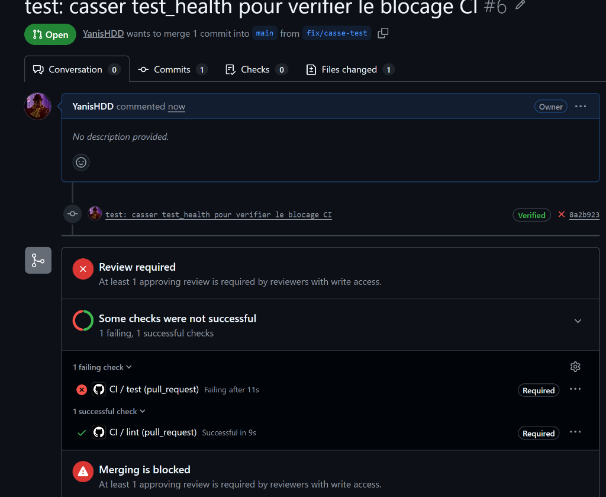

# TaskFlow — dépôt fil rouge CI/CD

[](https://github.com/YanisHDD/cicd-fil-rouge/actions/workflows/ci.yml)

TaskFlow est une petite API de gestion de tâches écrite en Python avec FastAPI.
C'est le projet fil rouge du module CI/CD (Mastère DevOps M1, Sup de Vinci) :
pendant trois jours, vous allez construire autour d'elle un pipeline complet
qui teste, construit, sécurise et livre l'application.

## Lancer l'API en local

Prérequis : Python 3.10 ou plus récent.

```bash
python3 -m venv .venv
source .venv/bin/activate          # Windows : .venv\Scripts\activate
pip install -r requirements-dev.txt
uvicorn app.main:app --reload
```

L'API répond sur http://localhost:8000 et sa documentation interactive est sur
http://localhost:8000/docs.

## Vérifier le code

```bash
pytest           # tests automatiques
ruff check .     # lint
ruff format .    # mise en forme
```

## Lancer avec Docker

```bash
docker build -t taskflow .
docker run --rm -p 8000:8000 taskflow
```

## Endpoints

| Méthode | Chemin | Rôle |
| --- | --- | --- |
| GET | `/health` | État de l'API et version |
| GET | `/tasks` | Liste des tâches |
| GET | `/tasks/search?q=...` | Recherche dans les titres |
| POST | `/tasks` | Crée une tâche (`{"title": "..."}`) |
| GET | `/tasks/{id}` | Détail d'une tâche |
| PATCH | `/tasks/{id}/done` | Marque une tâche comme faite |
| DELETE | `/tasks/{id}` | Supprime une tâche (en-tête `X-API-Token` requis) |

## Configuration

| Variable | Rôle | Défaut |
| --- | --- | --- |
| `APP_VERSION` | Version affichée par `/health` | `0.1.0` |
| `DB_PATH` | Fichier SQLite | `taskflow.db` |
| `API_TOKEN` | Jeton exigé pour supprimer une tâche | vide (suppression désactivée) |
| `NOTIFY_WEBHOOK_URL` | Webhook appelé à chaque création de tâche | vide (désactivé) |

## Équipe

- **Yanis Haddad** ([@YanisHDD](https://github.com/YanisHDD))
- **Moustapha ElJabri** ([@hping404](https://github.com/hping404))
- **Sofiane** ([@Soso9240](https://github.com/Soso9240))

## Gouvernance du dépôt

Pour garantir l'intégrité de la branche `main` et répondre aux exigences de traçabilité et de sécurité (Bloc 5 RNCP 40165), un **Ruleset** (`protect-main`) a été mis en place sur la branche par défaut.

### Règles configurées et justifications techniques

1. **Pull Request obligatoire avant tout merge (`Require a pull request before merging`) avec 1 approbation requise :**
   - *Justification :* Empêche tout commit direct non contrôlé sur la branche de référence. Chaque changement doit être documenté, inspecté et revu par les pairs (*peer review*).
2. **Invalidation des approbations lors de nouveaux commits (`Dismiss stale pull request approvals when new commits are pushed`) :**
   - *Justification :* Garantit que le code fusionné est strictement celui qui a été relu. Tout nouveau commit poussé après une approbation annule celle-ci et réimpose une relecture.
3. **Revue obligatoire par les Code Owners (`Require review from Code Owners`) :**
   - *Justification :* Couplée au fichier `.github/CODEOWNERS`, cette règle impose que toute modification des fichiers de pipeline (`/.github/workflows/`) soit obligatoirement validée par les responsables de l'infrastructure CI/CD (@YanisHDD ou @hping404). Modifier le pipeline équivaut à modifier les règles de conformité du projet.
4. **Interdiction des force pushes (`Block force pushes`) :**
   - *Justification :* Préserve l'immuabilité et la traçabilité de l'arbre Git. Empêche la réécriture d'historique qui masquerait des erreurs ou des régressions.
5. **Interdiction de suppression de branche (`Restrict deletions`) :**
   - *Justification :* Prémunit contre toute suppression accidentelle de la branche `main`.
6. **Bypass list vide (Aucune exception) :**
   - *Justification :* Principe du « sas opératoire » : tous les contributeurs, y compris les administrateurs, doivent se soumettre à la revue et aux contrôles.

### Preuve du blocage en push direct

Une tentative de push direct sur `main` a été exécutée depuis le terminal local :


**Résultat retourné par GitHub :**
```text
remote: error: GH013: Repository rule violations found for refs/heads/main.
remote: - Changes must be made through a pull request.
 ! [remote rejected] main -> main (push declined due to repository rule violations)
error: failed to push some refs to 'github.com:YanisHDD/cicd-fil-rouge.git'
```
Le push direct est strictement rejeté, prouvant l'efficacité de la règle de protection.

## Pipeline CI

Un workflow d'intégration continue a été déployé dans `.github/workflows/ci.yml`. Il est automatiquement déclenché à chaque ouverture ou mise à jour de Pull Request ciblant `main`.

### Description des jobs en parallèle

1. **`lint` (Contrôle qualité & formatage) :**
   - Environnement d'exécution : `ubuntu-latest` avec Python 3.12.
   - Installe les dépendances requises (`requirements-dev.txt`).
   - Analyse statique avec `ruff check .` : détecte les erreurs de syntaxe, imports inutilisés et mauvaises pratiques.
   - Contrôle du style avec `ruff format --check .` : garantit le respect de la norme PEP 8 et l'uniformité du code source.

2. **`test` (Tests automatisés) :**
   - Environnement d'exécution : `ubuntu-latest` avec Python 3.12.
   - Installe les dépendances applicatives et d'outillage de test.
   - Exécute l'ensemble des tests avec `pytest` pour valider le bon fonctionnement de l'API TaskFlow (santé, création, recherche, marquage et suppression de tâches).

Les deux jobs s'exécutent de façon concurrente et indépendante afin d'optimiser le temps global de rétroaction (*feedback loop*).

### Preuve du blocage de merge lors d'un échec de test

Pour valider l'efficacité du contrôle obligatoire imposé par le Ruleset, un échec volontaire a été injecté sur la branche `fix/casse-test` (assertion non respectée dans `tests/test_health.py`).



**Constat d'intégrité :**
- Le job `lint` s'exécute et réussit (`Successful in 9s`, statut `Required`).
- Le job `test` échoue (`Failing after 11s`, statut `Required`).
- Les deux jobs étant déclarés obligatoires dans le Ruleset de `main`, GitHub applique la politique de protection stricte : **la fusion est formellement bloquée (`Merging is blocked`)**, interdisant toute régression en production.

### Optimisations du pipeline (Lab J1 après-midi - Partie 2)

Afin d'accélérer le cycle de rétroaction (*feedback loop*) et d'éprouver la robustesse de l'API sur plusieurs environnements d'exécution, quatre améliorations ont été intégrées dans `.github/workflows/ci.yml` :

1. **Matrice de versions (`matrix`) :** Les tests sont exécutés en parallèle sous Python `3.11`, `3.12` et `3.13`. La directive `fail-fast: false` garantit que l'échec d'une version n'interrompt pas prématurément les autres.
2. **Mise en cache pip (`cache: 'pip'`) :** Les dépendances téléchargées sont conservées d'un run à l'autre via `actions/setup-python`, réduisant drastiquement le temps d'installation.
3. **Conservation des rapports de tests (`upload-artifact`) :** Chaque exécution génère un rapport XML JUnit (`junit-report-*.xml`) exporté en artefact téléchargeable pour audit et traçabilité.
4. **Gestion de concurrence (`concurrency`) :** Grâce à `cancel-in-progress: true`, tout nouveau commit sur une même Pull Request annule automatiquement le run précédent devenu obsolète, libérant ainsi des runners.

#### Rôle du job de synthèse `CI OK`

Lorsqu'une matrice est introduite, les noms de status checks deviennent dynamiques (`test (3.11)`, `test (3.12)`, `test (3.13)`). Le Ruleset de `main` qui attendait un contrôle nommé `test` bloque alors indéfiniment la Pull Request même si toutes les versions sont passées avec succès.

Le job `CI OK` résout ce problème architectural :
- Il dépend de l'ensemble des contrôles précédents via `needs: [lint, test]`.
- La clause `if: always()` est indispensable : elle force l'évaluation du job même si un job amont échoue (sans quoi un job ignoré/skipped pourrait être comptabilisé comme réussi par défaut).
- Il devient **l'unique check obligatoire** dans le Ruleset GitHub. On peut désormais modifier ou étendre la matrice Python à tout moment sans jamais toucher à la configuration de gouvernance du dépôt.

#### Comparatif des temps d'installation des dépendances (avec vs sans cache)

| Job | Durée d'installation sans cache | Durée d'installation avec cache | Gain constaté |
| --- | --- | --- | --- |
| `lint` (Python 3.12) | ~10s | ~4s | ~60% |
| `test` (Python 3.11) | ~12s | ~5s | ~58% |
| `test` (Python 3.12) | ~13s | ~5s | ~61% |
| `test` (Python 3.13) | ~14s | ~6s | ~57% |
