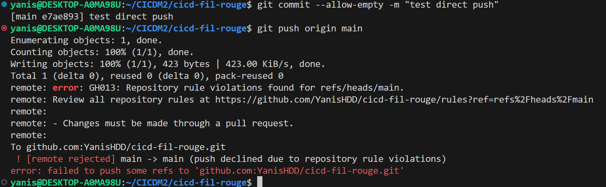

# TaskFlow — dépôt fil rouge CI/CD

TaskFlow est une petite API de gestion de tâches écrite en Python avec FastAPI.
C'est le projet fil rouge du module CI/CD (Mastère DevOps M1, Sup de Vinci) :
pendant trois jours, vous allez construire autour d'elle un pipeline complet
qui teste, construit, sécurise et livre l'application.

## Lancer l'API en local

Prérequis : Python 3.10 ou plus récent.

```bash
python3 -m venv .venv
source .venv/bin/activate          # Windows : .venv\Scripts\activate
pip install -r requirements-dev.txt
uvicorn app.main:app --reload
```

L'API répond sur http://localhost:8000 et sa documentation interactive est sur
http://localhost:8000/docs.

## Vérifier le code

```bash
pytest           # tests automatiques
ruff check .     # lint
ruff format .    # mise en forme
```

## Lancer avec Docker

```bash
docker build -t taskflow .
docker run --rm -p 8000:8000 taskflow
```

## Endpoints

| Méthode | Chemin | Rôle |
| --- | --- | --- |
| GET | `/health` | État de l'API et version |
| GET | `/tasks` | Liste des tâches |
| GET | `/tasks/search?q=...` | Recherche dans les titres |
| POST | `/tasks` | Crée une tâche (`{"title": "..."}`) |
| GET | `/tasks/{id}` | Détail d'une tâche |
| PATCH | `/tasks/{id}/done` | Marque une tâche comme faite |
| DELETE | `/tasks/{id}` | Supprime une tâche (en-tête `X-API-Token` requis) |

## Configuration

| Variable | Rôle | Défaut |
| --- | --- | --- |
| `APP_VERSION` | Version affichée par `/health` | `0.1.0` |
| `DB_PATH` | Fichier SQLite | `taskflow.db` |
| `API_TOKEN` | Jeton exigé pour supprimer une tâche | vide (suppression désactivée) |
| `NOTIFY_WEBHOOK_URL` | Webhook appelé à chaque création de tâche | vide (désactivé) |

## Équipe

- **Yanis Haddad** ([@YanisHDD](https://github.com/YanisHDD))
- **Moustapha ElJabri** ([@hping404](https://github.com/hping404))
- **Sofiane** ([@Soso9240](https://github.com/Soso9240))

## Gouvernance du dépôt

Pour garantir l'intégrité de la branche `main` et répondre aux exigences de traçabilité et de sécurité (Bloc 5 RNCP 40165), un **Ruleset** (`protect-main`) a été mis en place sur la branche par défaut.

### Règles configurées et justifications techniques

1. **Pull Request obligatoire avant tout merge (`Require a pull request before merging`) avec 1 approbation requise :**
   - *Justification :* Empêche tout commit direct non contrôlé sur la branche de référence. Chaque changement doit être documenté, inspecté et revu par les pairs (*peer review*).
2. **Invalidation des approbations lors de nouveaux commits (`Dismiss stale pull request approvals when new commits are pushed`) :**
   - *Justification :* Garantit que le code fusionné est strictement celui qui a été relu. Tout nouveau commit poussé après une approbation annule celle-ci et réimpose une relecture.
3. **Revue obligatoire par les Code Owners (`Require review from Code Owners`) :**
   - *Justification :* Couplée au fichier `.github/CODEOWNERS`, cette règle impose que toute modification des fichiers de pipeline (`/.github/workflows/`) soit obligatoirement validée par les responsables de l'infrastructure CI/CD (@YanisHDD ou @hping404). Modifier le pipeline équivaut à modifier les règles de conformité du projet.
4. **Interdiction des force pushes (`Block force pushes`) :**
   - *Justification :* Préserve l'immuabilité et la traçabilité de l'arbre Git. Empêche la réécriture d'historique qui masquerait des erreurs ou des régressions.
5. **Interdiction de suppression de branche (`Restrict deletions`) :**
   - *Justification :* Prémunit contre toute suppression accidentelle de la branche `main`.
6. **Bypass list vide (Aucune exception) :**
   - *Justification :* Principe du « sas opératoire » : tous les contributeurs, y compris les administrateurs, doivent se soumettre à la revue et aux contrôles.

### Preuve du blocage en push direct

Une tentative de push direct sur `main` a été exécutée depuis le terminal local :



**Résultat retourné par GitHub :**
```text
remote: error: GH013: Repository rule violations found for refs/heads/main.
remote: - Changes must be made through a pull request.
 ! [remote rejected] main -> main (push declined due to repository rule violations)
error: failed to push some refs to 'github.com:YanisHDD/cicd-fil-rouge.git'
```
Le push direct est strictement rejeté, prouvant l'efficacité de la règle de protection.
